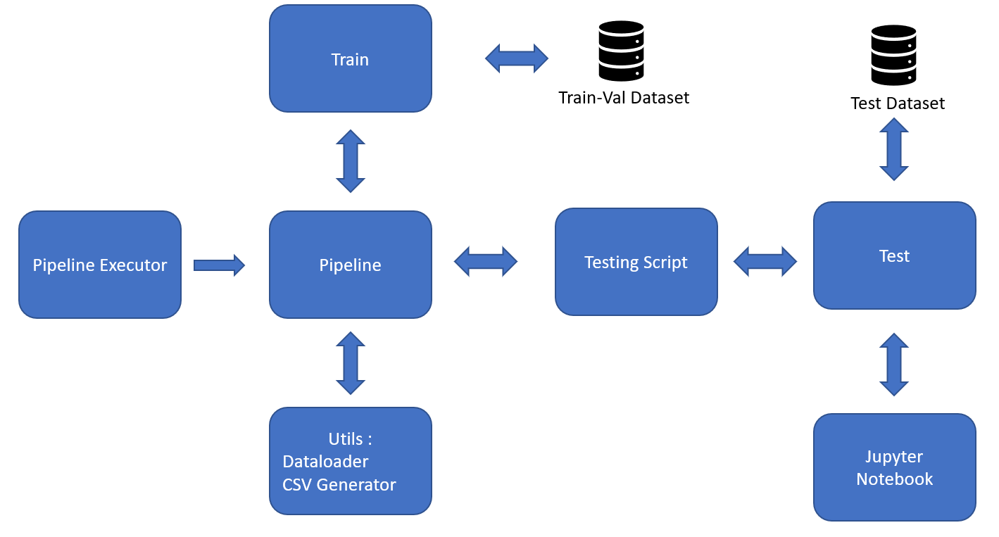

# BlurDetection

Task: Regression  
Data generated with: torchio 
Ranges for motion corruption:
	mode  : 2 -> Reality motion
	sigma : 0.01 - 0.2
	mu    : 0.0
Model: 2D Resnet101

# How to run the code

# Dataset creation 